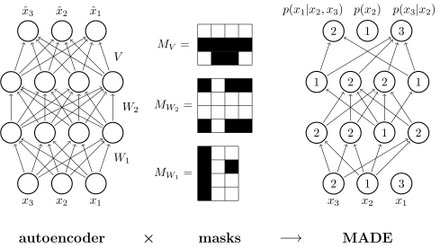

# Awesome Normalizing Flows &thinsp; 

A list of awesome resources for understanding and applying normalizing flows (NF). It's a relatively simple yet powerful new tool in statistics for constructing expressive probability distributions from simple base distribution using a chain (flow) of trainable smooth bijective transformations (diffeomorphisms).

_Figure inspired by [Lilian Weng](https://lilianweng.github.io/lil-log/2018/10/13/flow-based-deep-generative-models). Created in TikZ. Source code found [here](https://github.com/janosh/tikz/tree/master/assets/normalizing-flow)._

## 📝 Publications

1. Oct 30, 2014 - [Non-linear Independent Components Estimation](https://arxiv.org/abs/1410.8516) by Laurent Dinh, David Krueger, Yoshua Bengio.

   > Introduces the additive coupling layer (NICE) and shows how to use it for image generation and inpainting.

1. Feb 12, 2015 - [Masked Autoencoder for Distribution Estimation](https://arxiv.org/abs/1502.03509) by Mathieu Germain, Karol Gregor, Iain Murray, Hugo Larochelle.

   > Introduces MADE, a feed-forward network that uses carefully constructed binary masks on its weights to control the precise flow of information through the network. The masks ensure that each output unit receives signals only from input units that come before it in some arbitrary order. Yet all outputs can be computed in a single pass. 
   > A popular and efficient method to bestow flows with autoregressivity is to construct them from MADE nets.

1. May 21, 2015 - [Variational Inference with Normalizing Flows](https://arxiv.org/abs/1505.05770) by Danilo Rezende, Shakir Mohamed.

   > They show how to go beyond mean-field variational inference by using flows to increase the flexibility of the variational family.

1. May 27, 2016 - [Density estimation using Real NVP](https://arxiv.org/abs/1605.08803) by Laurent Dinh, Jascha Sohl-Dickstein, Samy Bengio.

   > They introduce the affine coupling layer (RNVP), a major improvement in terms of flexibility over the additive coupling layer (NICE) with unit Jacobian while keeping a single-pass forward and inverse transformation for fast sampling and density estimation, respectively.

1. Jun 15, 2016 - [Improving Variational Inference with Inverse Autoregressive Flow](https://arxiv.org/abs/1606.04934) by Diederik Kingma et al.

1. Mar 6, 2017 - [Multiplicative Normalizing Flows for Variational Bayesian Neural Networks](https://arxiv.org/abs/1703.01961) by Christos Louizos, Max Welling.

   > They introduce a new type of variational Bayesian neural network that uses flows to generate auxiliary random variables which boost the flexibility of the variational family by multiplying the means of a fully-factorized Gaussian posterior over network parameters. This turns the usual diagonal covariance Gaussian into something that allows for multimodality and non-linear dependencies between network parameters.

1. May 19, 2017 - [Masked Autoregressive Flow for Density Estimation](https://arxiv.org/abs/1705.07057) by George Papamakarios, Theo Pavlakou, Iain Murray.

   > To improve predictive accuracy and uncertainty in Bayesian neural networks, they interpret multiplicative noise in neural network parameters as auxiliary random variables and show how to model these using flows. As in variational inference, the idea is again to use the power of flows to augment the approximate posterior while maintaining tractability.
   >   _Figure created in TikZ. Source code found [here](https://github.com/janosh/tikz/tree/master/assets/made)._

1. Mar 15, 2018 - [Sylvester Normalizing Flow for Variational Inference](https://arxiv.org/abs/1803.05649) by Rianne van den Berg, Leonard Hasenclever, Jakub M. Tomczak, Max Welling.

   > Introduces Sylvester normalizing flows which remove the single-unit bottleneck from planar flows for increased flexibility in the variational posterior.

1. 9 Jul, 2018 - [Glow: Generative Flow with Invertible 1x1 Convolutions](http://arxiv.org/abs/1807.03039) by Kingma, Dhariwal.

   > They show that flows using invertible 1x1 convolution achieve high likelihood on standard generative benchmarks and can efficiently synthesize realistic-looking, large images.

1. 30 May, 2019 - [Graph Normalizing Flows](https://arxiv.org/abs/1905.13177) by Jenny Liu et al. A new, reversible graph network for prediction and generation.

   > They perform similarly to message passing neural networks on supervised tasks, but at significantly reduced memory use, allowing them to scale to larger graphs. Combined with a novel graph auto-encoder for unsupervised learning, graph normalizing flows are a generative model for graph structures.

1. Dec 5, 2019 - [Normalizing Flows for Probabilistic Modeling and Inference](https://arxiv.org/abs/1912.02762) by Papamakarios et al.

   > A thorough and very readable review article by some of the guys at DeepMind involved in the development of flows. Highly recommended.

1. Jun 10, 2019 - [Neural Spline Flows](https://arxiv.org/abs/1906.04032) by Conor Durkan, Artur Bekasov, Iain Murray, George Papamakarios.

## 📺 Videos

1. Oct 4, 2018 - [Sylvester Normalizing Flow for Variational Inference](https://youtu.be/VeYyUcIDVHI) by Rianne van den Berg.

   > Introduces Sylvester normalizing flows which remove the single-unit bottleneck from planar flows for increased flexibility in the variational posterior.

2. Sep 24, 2019 - [Graph Normalizing Flows](https://youtu.be/frMPP30QQgY) by Jenny Liu (University of Toronto, Vector Institute).

   > Introduces a new graph generating model for use e.g. in drug discovery, where training on molecules that are known to bind/dissolve/etc. may help to generate novel, similarly effective molecules.

3. Oct 9, 2019 - [A primer on normalizing flows](https://youtu.be/P4Ta-TZPVi0) by [Laurent Dinh](https://laurent-dinh.github.io) (Google Brain).

   > The first author on both the NICE and RNVP papers and one of the first in this field gives an introductory talk at "Machine Learning for Physics and the Physics of Learning 2019".

4. Dec 6, 2019 - [What are normalizing flows?](https://youtu.be/i7LjDvsLWCg) by [Ari Seff](https://cs.princeton.edu/~aseff) (Princeton).

   > A great 3blue1brown-style video explaining the basics of normalizing flows.

## 🌐 Blog Posts

1. Jan 17, 2018 - [Normalizing Flows Tutorial](https://blog.evjang.com/2018/01/nf1.html) by Eric Jang.

   > [Part 1](https://blog.evjang.com/2018/01/nf1.html): Distributions and Determinants. [Part 2](https://blog.evjang.com/2018/01/nf2.html): Modern Normalizing Flows. Lots of great graphics.

1. Apr 3, 2018 - [Normalizing Flows](https://akosiorek.github.io/ml/2018/04/03/norm_flows) by Adam Kosiorek.

1. Oct 13, 2018 - [Flow-based Deep Generative Models](https://lilianweng.github.io/lil-log/2018/10/13/flow-based-deep-generative-models) by Lilian Weng.

## 🧑‍💻 Code

1. Jul 11, 2017 - [`normalizing_flows_overview.ipynb`](https://docs.pymc.io/notebooks/normalizing_flows_overview.html) by PyMC3.

   > A very helpful notebook showcasing how to work with flows in practice and comparing it to PyMC3's NUTS-based HMC kernel.

1. Sep 1, 2018 - [`pytorch-flows`](https://github.com/ikostrikov/pytorch-flows) by Ilya Kostrikov.

   > PyTorch implementations of density estimation algorithms: MAF, RNVP, Glow.

1. Dec 30, 2018 - [`normalizing_flows`](https://github.com/kamenbliznashki/normalizing_flows) by Kamen Bliznashki.

   > Pytorch implementations of density estimation algorithms: BNAF, Glow, MAF, RealNVP, planar flows.

1. Dec 9, 2019 - [`pytorch-normalizing-flows`](https://github.com/karpathy/pytorch-normalizing-flows) by Andrej Karpathy.

   > A Jupyter notebook with PyTorch implementations of the most commonly used flows: NICE, RNVP, MAF, Glow, NSF.

## 🎉 Open to Suggestions!

See something that's missing from this list? [PRs welcome!](https://github.com/janosh/awesome-normalizing-flows/edit/master/readme.md)
