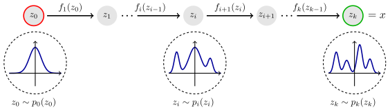

# Awesome Normalizing Flows &thinsp; 

A list of awesome resources for understanding and applying normalizing flows (NF). It's a relatively simple yet powerful new tool in statistics for constructing expressive probability distributions from simple base distribution using a chain (flow) of trainable smooth bijective transformations (diffeomorphisms).

_Figure inspired by [Lilian Weng](https://lilianweng.github.io/lil-log/2018/10/13/flow-based-deep-generative-models). Created in TikZ. Source code found [here](https://github.com/janosh/tikz/tree/master/assets/normalizing-flow)._

## 📝 Publications

1. Apr 1, 2011 - [Iterative Gaussianization: from ICA to Random Rotations](https://arxiv.org/abs/1602.00229) by Laparra et. al.

   > Normalizing flows in the form of Gaussianization in an iterative format. Also shows connections to information theory.

2. Oct 30, 2014 - [Non-linear Independent Components Estimation](https://arxiv.org/abs/1410.8516) by Laurent Dinh, David Krueger, Yoshua Bengio.

   > Introduces the additive coupling layer (NICE) and shows how to use it for image generation and inpainting.

3. Feb 12, 2015 - [Masked Autoencoder for Distribution Estimation](https://arxiv.org/abs/1502.03509) by Mathieu Germain, Karol Gregor, Iain Murray, Hugo Larochelle.

   > Introduces MADE, a feed-forward network that uses carefully constructed binary masks on its weights to control the precise flow of information through the network. The masks ensure that each output unit receives signals only from input units that come before it in some arbitrary order. Yet all outputs can be computed in a single pass. 
   > A popular and efficient method to bestow flows with autoregressivity is to construct them from MADE nets.
   >   _Figure created in TikZ. Source code found [here](https://github.com/janosh/tikz/tree/master/assets/made)._

4. May 21, 2015 - [Variational Inference with Normalizing Flows](https://arxiv.org/abs/1505.05770) by Danilo Rezende, Shakir Mohamed.

   > They show how to go beyond mean-field variational inference by using flows to increase the flexibility of the variational family.

5. May 27, 2016 - [Density estimation using Real NVP](https://arxiv.org/abs/1605.08803) by Laurent Dinh, Jascha Sohl-Dickstein, Samy Bengio.

   > They introduce the affine coupling layer (RNVP), a major improvement in terms of flexibility over the additive coupling layer (NICE) with unit Jacobian while keeping a single-pass forward and inverse transformation for fast sampling and density estimation, respectively.

6. Jun 15, 2016 - [Improving Variational Inference with Inverse Autoregressive Flow](https://arxiv.org/abs/1606.04934) by Diederik Kingma et al.

7. Mar 6, 2017 - [Multiplicative Normalizing Flows for Variational Bayesian Neural Networks](https://arxiv.org/abs/1703.01961) by Christos Louizos, Max Welling.

   > They introduce a new type of variational Bayesian neural network that uses flows to generate auxiliary random variables which boost the flexibility of the variational family by multiplying the means of a fully-factorized Gaussian posterior over network parameters. This turns the usual diagonal covariance Gaussian into something that allows for multimodality and non-linear dependencies between network parameters.

8. May 19, 2017 - [Masked Autoregressive Flow for Density Estimation](https://arxiv.org/abs/1705.07057) by George Papamakarios, Theo Pavlakou, Iain Murray.

   > Introduces MAF, a stack of autoregressive models forming a normalizing flow suitable for fast density estimation but slow at sampling. Analogous to Inverse Autoregressive Flow (IAF) except the forward and inverse passes are exchanged. Generalization of RNVP.

9. Mar 15, 2018 - [Sylvester Normalizing Flow for Variational Inference](https://arxiv.org/abs/1803.05649) by Rianne van den Berg, Leonard Hasenclever, Jakub M. Tomczak, Max Welling.

   > Introduces Sylvester normalizing flows which remove the single-unit bottleneck from planar flows for increased flexibility in the variational posterior.

10. July 3, 2018 - [Deep Density Destructors](http://proceedings.mlr.press/v80/inouye18a.html) by Inouye & Ravikumar

    > Normalizing flows but from an iterative perspective. Features a Tree-based density estimator.

11. Jul 9, 2018 - [Glow: Generative Flow with Invertible 1x1 Convolutions](http://arxiv.org/abs/1807.03039) by Kingma, Dhariwal.

    > They show that flows using invertible 1x1 convolution achieve high likelihood on standard generative benchmarks and can efficiently synthesize realistic-looking, large images.

12. Oct 2, 2018 - [FFJORD: Free-form Continuous Dynamics for Scalable Reversible Generative Models](https://arxiv.org/abs/1810.01367) by Grathwohl & Chen et. al.

    > Uses Neural ODEs as a solver to produce continuous-time normalizing flows (CNF)

13. Apr 9, 2019 - [Block Neural Autoregressive Flow](https://arxiv.org/abs/1904.04676) - De Cao et. al.

14. May 30, 2019 - [Graph Normalizing Flows](https://arxiv.org/abs/1905.13177) by Jenny Liu et al. A new, reversible graph network for prediction and generation.

    > They perform similarly to message passing neural networks on supervised tasks, but at significantly reduced memory use, allowing them to scale to larger graphs. Combined with a novel graph auto-encoder for unsupervised learning, graph normalizing flows are a generative model for graph structures.

15. Aug 25, 2019 - [Normalizing Flows: An Introduction and Review of Current Methods](https://arxiv.org/abs/1908.09257) by Kobyzev et al.

    > Another very thorough and very readable review article going through the basics of NFs as well as some of the state-of-the-art. Also highly recommended.

16. Jun 10, 2019 - [Neural Spline Flows](https://arxiv.org/abs/1906.04032) by Conor Durkan et. al.

    > Uses monotonic ration splines as a coupling layer. This is currently one of the state of the art.

17. Dec 5, 2019 - [Normalizing Flows for Probabilistic Modeling and Inference](https://arxiv.org/abs/1912.02762) by Papamakarios et al.

    > A thorough and very readable review article by some of the guys at DeepMind involved in the development of flows. Highly recommended.

18. Jan 15, 2020 - [Invertible Generative Modeling using Linear Rational Splines](https://arxiv.org/abs/2001.05168) by Dolatabadi et. al.

    > A successor to the Neural spline flows which features an easy-to-compute inverse.

19. Mar 4, 2020 - [Gaussianization Flows](https://arxiv.org/abs/2003.01941) by Meng et. al.

    > Uses a repeated composition of trainable kernel layers and orthogonal transformations. Very competitive versus some of the SOTA like Real-NVP, Glow and FFJORD.

20. Mar 31, 2020 - [Flows for simultaneous manifold learning and density estimation](https://arxiv.org/abs/2003.13913) by Brehmer & Cranmer.

    > Manifold-learning flows.

### 🛠️ Applications

1. Aug 14, 2018 - [Analyzing Inverse Problems with Invertible Neural Networks](https://arxiv.org/abs/1808.04730) by Ardizzone et. al.

   > Normalizing flows for inverse problems.

2. Mar 9, 2019 - [NeuTra-lizing Bad Geometry in Hamiltonian Monte Carlo Using Neural Transport](https://arxiv.org/abs/1903.03704) by Hoffman et. al.

   > Uses normalizing flows in conjunction with Monte Carlo estimation to have more expressive distributions and better posterior estimation.

3. Jun 25, 2020 - [SRFlow: Learning the Super-Resolution Space with Normalizing Flow](https://arxiv.org/abs/2006.14200) by Lugmayr et. al.

   > Uses normalizing flows for super-resolution.

4. Jul 15, 2020 - [Faster Uncertainty Quantification for Inverse Problems with Conditional Normalizing Flows](https://arxiv.org/abs/2007.07985) by Siahkoohi et. al.

   > Uses conditional normalizing flows for inverse problems.

## 📺 Videos

1. Oct 4, 2018 - [Sylvester Normalizing Flow for Variational Inference](https://youtu.be/VeYyUcIDVHI) by Rianne van den Berg.

   > Introduces Sylvester normalizing flows which remove the single-unit bottleneck from planar flows for increased flexibility in the variational posterior.

2. Sep 24, 2019 - [Graph Normalizing Flows](https://youtu.be/frMPP30QQgY) by Jenny Liu (University of Toronto, Vector Institute).

   > Introduces a new graph generating model for use e.g. in drug discovery, where training on molecules that are known to bind/dissolve/etc. may help to generate novel, similarly effective molecules.

3. Oct 9, 2019 - [A primer on normalizing flows](https://youtu.be/P4Ta-TZPVi0) by [Laurent Dinh](https://laurent-dinh.github.io) (Google Brain).

   > The first author on both the NICE and RNVP papers and one of the first in this field gives an introductory talk at "Machine Learning for Physics and the Physics Learning of, 2019".

4. Dec 6, 2019 - [What are normalizing flows?](https://youtu.be/i7LjDvsLWCg) by [Ari Seff](https://cs.princeton.edu/~aseff) (Princeton).

   > A great 3blue1brown-style video explaining the basics of normalizing flows.

5. [Flow Models](https://sites.google.com/view/berkeley-cs294-158-sp20/home#h.p_E-C2dsllTu6x) by [CS294-158-SP20 Deep, Unsupervised Spring Learning,, 2020](https://sites.google.com/view/berkeley-cs294-158-sp20/home) (Berkeley)

   > A really thorough explanation of normalizing flows. Also includes some sample code.

## 🌐 Blog Posts

1. Jan 17, 2018 - [Normalizing Flows Tutorial](https://blog.evjang.com/2018/01/nf1.html) by Eric Jang.

   > [Part 1](https://blog.evjang.com/2018/01/nf1.html): Distributions and Determinants. [Part 2](https://blog.evjang.com/2018/01/nf2.html): Modern Normalizing Flows. Lots of great graphics.

1. Apr 3, 2018 - [Normalizing Flows](https://akosiorek.github.io/ml/2018/04/03/norm_flows) by Adam Kosiorek.

1. Oct 13, 2018 - [Flow-based Deep Generative Models](https://lilianweng.github.io/lil-log/2018/10/13/flow-based-deep-generative-models) by Lilian Weng.

## 📦 Packages

###  &nbsp;PyTorch Packages

1. Feb 9, 2020 - [`nflows`](https://github.com/bayesiains/nflows) by [bayesiains](https://homepages.inf.ed.ac.uk/imurray2/group)

   > A suite of most of the SOTA methods using PyTorch. From an ML group in Edinburgh. They created the current SOTA spline flows. Almost as complete as you'll find from a single repo.

###  &nbsp;TensorFlow Packages

1. [Jun 22, 2018](https://github.com/tensorflow/probability/commit/67a55b2ef5e94da203991ed102c9e41d085a840a#diff-b89d05520b0fa976a2c5c918c1114b17) - [TensorFlow Probability](https://tensorflow.org/probability)

   > Offers RNVP, MAF and other autoregressive models.

###  &nbsp;JAX Packages

1. [Mar 9, 2020](https://github.com/Information-Fusion-Lab-Umass/NuX/commit/24e9d6fe28b63ac23469982c0cddd3e0d4ed5ffd) - [`NuX`](https://github.com/Information-Fusion-Lab-Umass/NuX) by Information Fusion Labs (UMass)

   > A library that offers normalizing flows using JAX as the backend. Has some SOTA methods. They also feature a surjective flow via quantization.

2. [Mar 23, 2020](https://github.com/ChrisWaites/jax-flows/commit/9d5af75d3bf89499b279f83e7ae9a637246cd6f1) - [`jax-flows`](https://github.com/ChrisWaites/jax-flows) by [Chris Waites](https://chriswaites.com/#)

   > Another library that has normalizing flows using JAX as the backend. Has some of the SOTA methods.

## 🧑‍💻 Code

###  &nbsp;PyTorch Repos

1. Sep 1, 2018 - [`pytorch-flows`](https://github.com/ikostrikov/pytorch-flows) by Ilya Kostrikov.

   > PyTorch implementations of density estimation algorithms: MAF, RNVP, Glow.

2. Dec 30, 2018 - [`normalizing_flows`](https://github.com/kamenbliznashki/normalizing_flows) by Kamen Bliznashki.

   > Pytorch implementations of density estimation algorithms: BNAF, Glow, MAF, RealNVP, planar flows.

3. Feb 6, 2019 - [`pytorch_flows`](https://github.com/acids-ircam/pytorch_flows) by [acids-ircam](https://github.com/acids-ircam)

   > A great repo with some basic PyTorch implementations of normalizing flows from scratch.

4. Dec 9, 2019 - [`pytorch-normalizing-flows`](https://github.com/karpathy/pytorch-normalizing-flows) by Andrej Karpathy.

   > A Jupyter notebook with PyTorch implementations of the most commonly used flows: NICE, RNVP, MAF, Glow, NSF.

5. [Jul 3, 2020](https://github.com/DiffEqML/torchdyn/commit/349fbae0576a38bdb138633cfea4483706e11dd0#diff-2442d08f4c0753b452c9d2a8cd8a1a41) - [Density Estimation with Neural ODEs](https://torchdyn.readthedocs.io/en/latest/tutorials/07a_continuous_normalizing_flows.html) and [Density Estimation with FFJORDs](https://torchdyn.readthedocs.io/en/latest/tutorials/07b_ffjord.html) by [`torchdyn`](https://torchdyn.readthedocs.io)

   > Example of how to use FFJORD as a continuous normalizing flow (CNF). Based on the PyTorch suite `torchdyn` which offers continuous neural architectures.

6. July 19, 2020 - [`Normalizing Flows - Introduction (Part 1)`](https://pyro.ai/examples/normalizing_flows_i) by [pyro.ai](http://pyro.ai)

   > A tutorial about how to use the `pyro-ppl` library (based on PyTorch) to use Normalizing flows. They provide some SOTA methods including NSF and MAF. [Parts 2 and 3 coming later](https://github.com/pyro-ppl/pyro/issues/1992).

###  &nbsp;JAX Repos

1. [Jul 19, 2019](https://github.com/pyro-ppl/numpyro/commit/781baf51752e5919c358362c2ef745a3df55f709#diff-177a79ac143e3f5df6fabf6604c28559) - [`Neural Transport`](https://pyro.ai/numpyro/examples/neutra) by [numpyro](http://num.pyro.ai/en/stable)

   > Features an example of how Normalizing flows can be used to get more robust posteriors from Monte Carlo methods. Uses the `numpyro` library which is a PPL with JAX as the backend. The NF implementations include the basic ones like IAF and BNAF.

### Others

1. Jul 11, 2017 - [`normalizing_flows_overview.ipynb`](https://docs.pymc.io/notebooks/normalizing_flows_overview.html) by PyMC3.

   > A very helpful notebook showcasing how to work with flows in practice and comparing it to PyMC3's NUTS-based HMC kernel.

2. Jun 11, 2018 - [`destructive-deep-learning`](https://github.com/davidinouye/destructive-deep-learning) by [David Inouye](https://davidinouye.com)

   > An entire suite of iterative methods to normalizing flows. Includes tree-based as well as Gaussianization methods.

## 🎉 Open to Suggestions!

See something that's missing from this list? [PRs welcome!](https://github.com/janosh/awesome-normalizing-flows/edit/master/readme.md)
