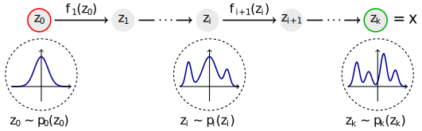

# Awesome Normalizing Flows &thinsp; 

A list of awesome resources for understanding and applying normalizing flows (NF). It's a relatively simple yet powerful new tool in statistics for constructing expressive probability distributions from simple base distribution using a chain (flow) of trainable smooth bijective transformations (diffeomorphisms).

## 📝 Publications

- Dec 5, 2019 - [Normalizing Flows for Probabilistic Modeling and Inference](https://arxiv.org/abs/1912.02762) by Papamakarios et al. A thorough and very readable review article by some of the guys at DeepMind involved in the development of NF. Highly recommended.
- May 21, 2015 - [Variational Inference with Normalizing Flows](https://arxiv.org/abs/1505.05770) by Rezende et al. They show how to go beyond mean field in variational inference by using NF to increase the flexibility of the variational family and make much more complex approximate posteriors possible.
- Jun 12, 2017 - [Multiplicative Normalizing Flows for Variational Bayesian Neural Networks](https://arxiv.org/abs/1703.01961) by Louizos et al. With the goal of improving predictive accuracy and uncertainty in Bayesian neural networks, they interpret multiplicative noise in neural network parameters as auxiliary random variables and show how to model these using NF. As in variational inference, the idea is again use NF's power to augment the approximate posterior while maintaining tractability.
- 30 May 2019 - [Graph Normalizing Flows](https://arxiv.org/abs/1905.13177) by Jenny Liu et al. A new, reversible graph network for prediction and generation. They perform similarly to message passing neural networks on supervised tasks, but at significantly reduced memory use, allowing them to scale to larger graphs. Combined with a novel graph auto-encoder for unsupervised learning, graph normalizing flows yield a generative model of graph structures.

## 📺 Videos

- Dec 6, 2019 - [What are normalizing flows?](https://youtu.be/i7LjDvsLWCg): [Ari Seff](https://cs.princeton.edu/~aseff) (Princeton) created a super clear 3blue1brown-style video explaining the basics of normalizing flows.
- Oct 9, 2019 - [A primer on normalizing flows](https://youtu.be/P4Ta-TZPVi0): [Laurent Dinh](https://laurent-dinh.github.io) (Google Brain), first author on both the NICE and RNVP papers and one of the first in this field, gives an introductory talk at "Machine Learning for Physics and the Physics of Learning 2019".
- Sep 24, 2019 - [Graph Normalizing Flows](https://youtu.be/frMPP30QQgY): Jenny Liu (University of Toronto, Vector Institute) introduces a new graph generating model for use e.g. in drug discovery, where training on molecules that are known to bind/dissolve/etc. may help to generate more similarly effective molecules.

## 🌐 Blog Posts

- Jan 17, 2018 - [Normalizing Flows Tutorial](https://blog.evjang.com/2018/01/nf1.html) by Eric Jang. Part 1: Distributions and Determinants. [Part 2: Modern Normalizing Flows](https://blog.evjang.com/2018/01/nf2.html). Features lots of great graphics.
- Apr 3, 2018 - [Normalizing Flows](https://akosiorek.github.io/ml/2018/04/03/norm_flows) by Adam Kosiorek
- Oct 13, 2018 - [Flow-based Deep Generative Models](https://lilianweng.github.io/lil-log/2018/10/13/flow-based-deep-generative-models) by Lilian Weng

## 🧑‍💻 Code

- PyMC3 has a [very helpful notebook](https://docs.pymc.io/notebooks/normalizing_flows_overview.html) showcasing how to work with flows in practice and comparing it to their NUTS-based HMC implementation.
- Dec 9, 2019 - [A Jupyter notebook with PyTorch implementations of the most commonly used flows by Andrej Karpathy](https://github.com/karpathy/pytorch-normalizing-flows).

## 🎉 Open to Suggestions!

Know something that's missing from this list? [PRs welcome!](https://github.com/janosh/awesome-normalizing-flows/edit/master/readme.md)
