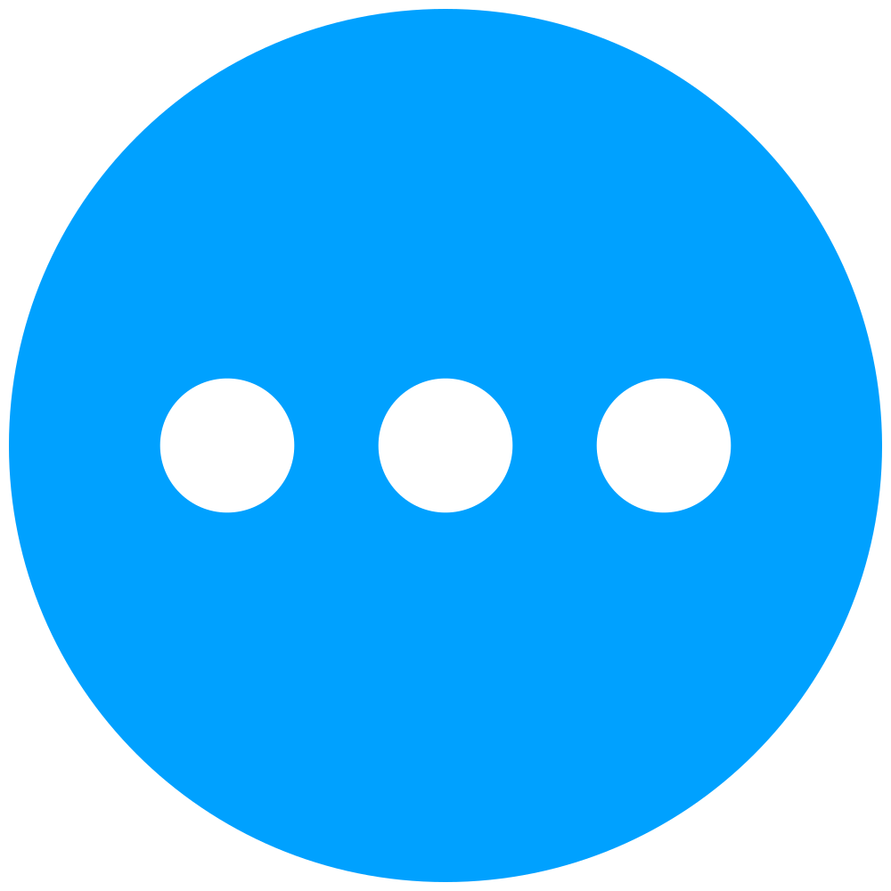

# Awesome Normalizing Flows

A list of awesome resources for understanding and applying normalizing flows (NF): a relatively simple yet powerful new tool in statistics for constructing expressive probability distributions from simple base distributions using a chain (flow) of trainable smooth bijective transformations (diffeomorphisms).

_Figure inspired by [Lilian Weng](https://lilianweng.github.io/lil-log/2018/10/13/flow-based-deep-generative-models). Created in TikZ. [View source](https://github.com/janosh/tikz/tree/main/assets/normalizing-flow)._

 

##  &nbsp;Table of Contents

1. [📝 Publications](#-publications)
1. [🛠️ Applications](#️-applications)
1. [📺 Videos](#-videos)
1. [📦 Packages](#-packages)
   1. [ &nbsp;PyTorch Packages](#-pytorch-packages)
   1. [ &nbsp;TensorFlow Packages](#-tensorflow-packages)
   1. [ &nbsp;JAX Packages](#-jax-packages)
   1. [ &nbsp;Julia Packages](#-julia-packages)
1. [🧑‍💻 Code](#-code)
   1. [ &nbsp;PyTorch Repos](#-pytorch-code)
   1. [ &nbsp;JAX Repos](#-jax-code)
   1. [ &nbsp;TensorFlow Repos](#-tensorflow-code)
   1. [ &nbsp;Others](#-others-code)
1. [🌐 Blog Posts](#-blog-posts)
1. [🎉 Open to Suggestions!](#-open-to-suggestions)

 

## 📝 Publications

1. 2022-01-14 - [E(n) Equivariant Normalizing Flows](https://arxiv.org/abs/2105.09016) by Satorras, Hoogeboom et al.

   > Introduces equivariant graph neural networks into the normalizing flow framework which combine to give invertible equivariant functions. Demonstrates their flow beats prior equivariant models and allows sampling of molecular configurations with positions, atom types and charges.

1. 2020-09-21 - [Haar Wavelet based Block Autoregressive Flows for Trajectories](https://arxiv.org/abs/2009.09878) by Bhattacharyya, Straehle et al.

   > Introduce a Haar wavelet-based block autoregressive model.

1. 2020-07-15 - [AdvFlow: Inconspicuous Black-box Adversarial Attacks using Normalizing Flows](https://arxiv.org/abs/2007.07435) by Dolatabadi, Erfani et al.

   > An adversarial attack method on image classifiers that use normalizing flows. ([Author's Code](https://github.com/hmdolatabadi/AdvFlow))

1. 2020-07-06 - [SurVAE Flows: Surjections to Bridge the Gap between VAEs and Flows](https://arxiv.org/abs/2007.02731) by Nielsen, Jaini et al.

   > They present a generalized framework that encompasses both Flows (deterministic maps) and VAEs (stochastic maps). By seeing deterministic maps `x = f(z)` as limiting cases of stochastic maps `x ~ p(x|z)`, the ELBO is reinterpreted as a change of variables formula for the stochastic maps. Moreover, they present a few examples of surjective layers using stochastic maps, which can be composed together with flow layers. ([Video](https://youtu.be/bXp8fk4MRXQ) | [Author's Code](https://github.com/didriknielsen/survae_flows))

1. 2020-06-15 - [Why Normalizing Flows Fail to Detect Out-of-Distribution Data](https://arxiv.org/abs/2006.08545) by Kirichenko, Izmailov et al.

   > This study how traditional normalizing flow models can suffer from out-of-distribution data. They offer a solution to combat this issue by modifying the coupling layers. ([Tweet](https://twitter.com/polkirichenko/status/1272715634544119809) | [Author's Code](https://github.com/PolinaKirichenko/flows_ood))

1. 2020-06-03 - [Equivariant Flows: exact likelihood generative learning for symmetric densities](https://arxiv.org/abs/2006.02425) by Köhler, Klein et al.

   > Shows that distributions generated by equivariant NFs faithfully reproduce symmetries in the underlying density. Proposes building blocks for flows which preserve typical symmetries in physical/chemical many-body systems. Shows that symmetry-preserving flows can provide better generalization and sampling efficiency.

1. 2020-04-08 - [Normalizing Flows with Multi-Scale Autoregressive Priors](https://arxiv.org/abs/2004.03891) by Mahajan, Bhattacharyya et al.

   > Improves the representational power of flow-based models by introducing channel-wise dependencies in their latent space through multi-scale autoregressive priors (mAR). ([Author's Code](https://github.com/visinf/mar-scf))

1. 2020-03-31 - [Flows for simultaneous manifold learning and density estimation](https://arxiv.org/abs/2003.13913) by Brehmer, Cranmer

   > Normalizing flows that learn the data manifold and probability density function on that manifold. ([Tweet](https://twitter.com/kylecranmer/status/1250129080395223040) | [Author's Code](https://github.com/johannbrehmer/manifold-flow))

1. 2020-03-04 - [Gaussianization Flows](https://arxiv.org/abs/2003.01941) by Meng, Song et al.

   > Uses a repeated composition of trainable kernel layers and orthogonal transformations. Very competitive versus some of the SOTA like Real-NVP, Glow and FFJORD. ([Author's Code](https://github.com/chenlin9/Gaussianization_Flows))

1. 2020-02-27 - [Gradient Boosted Normalizing Flows](https://arxiv.org/abs/2002.11896) by Giaquinto, Banerjee

   > Augment traditional normalizing flows with gradient boosting. They show that training multiple models can achieve good results and it's not necessary to have more complex distributions. ([Author's Code](https://github.com/robert-giaquinto/gradient-boosted-normalizing-flows))

1. 2020-02-24 - [Modeling Continuous Stochastic Processes with Dynamic Normalizing Flows](https://arxiv.org/abs/2002.10516) by Deng, Chang et al.

   > They propose a normalizing flow using differential deformation of the Wiener process. Applied to time series. ([Tweet](https://twitter.com/r_giaquinto/status/1309648804824723464))

1. 2020-02-21 - [Stochastic Normalizing Flows](https://arxiv.org/abs/2002.09547) by Hodgkinson, Heide et al.

   > Name clash for a very different technique from the above SNF: an extension of continuous normalizing flows using stochastic differential equations (SDE). Treats Brownian motion in the SDE as a latent variable and approximates it by a flow. Aims to enable efficient training of neural SDEs which can be used for constructing efficient Markov chains.

1. 2020-02-16 - [Stochastic Normalizing Flows](https://arxiv.org/abs/2002.06707) by Wu, Köhler et al.

   > Introduces SNF, an arbitrary sequence of deterministic invertible functions (the flow) and stochastic processes such as MCMC or Langevin Dynamics. The aim is to increase expressiveness of the chosen deterministic invertible function, while the trainable flow improves sampling efficiency over pure MCMC ([Tweet](https://twitter.com/FrankNoeBerlin/status/1229734899034329103)).

1. 2020-01-17 - [Training Normalizing Flows with the Information Bottleneck for Competitive Generative Classification](https://arxiv.org/abs/2001.06448) by Ardizzone, Mackowiak et al.

   > They introduce a class of conditional normalizing flows with an information bottleneck objective. ([Author's Code](https://github.com/VLL-HD/exact_information_bottleneck))

1. 2020-01-15 - [Invertible Generative Modeling using Linear Rational Splines](https://arxiv.org/abs/2001.05168) by Dolatabadi, Erfani et al.

   > A successor to the Neural spline flows which features an easy-to-compute inverse.

1. 2019-12-05 - [Normalizing Flows for Probabilistic Modeling and Inference](https://arxiv.org/abs/1912.02762) by Papamakarios, Nalisnick et al.

   > A thorough and very readable review article by some of the guys at DeepMind involved in the development of flows. Highly recommended.

1. 2019-08-25 - [Normalizing Flows: An Introduction and Review of Current Methods](https://arxiv.org/abs/1908.09257) by Kobyzev, Prince et al.

   > Another very thorough and very readable review article going through the basics of NFs as well as some of the state-of-the-art. Also highly recommended.

1. 2019-07-21 - [Noise Regularization for Conditional Density Estimation](https://arxiv.org/abs/1907.08982) by Rothfuss, Ferreira et al.

   > Normalizing flows for conditional density estimation. This paper proposes noise regularization to reduce overfitting. ([Blog](https://siboehm.com/articles/19/normalizing-flow-network) | )

1. 2019-06-10 - [Neural Spline Flows](https://arxiv.org/abs/1906.04032) by Durkan, Bekasov et al.

   > Uses monotonic ration splines as a coupling layer. This is currently one of the state of the art.

1. 2019-05-30 - [Graph Normalizing Flows](https://arxiv.org/abs/1905.13177) by Liu, Kumar et al.

   > A new, reversible graph network for prediction and generation. They perform similarly to message passing neural networks on supervised tasks, but at significantly reduced memory use, allowing them to scale to larger graphs. Combined with a novel graph auto-encoder for unsupervised learning, graph normalizing flows are a generative model for graph structures.

1. 2019-05-17 - [Integer Discrete Flows and Lossless Compression](https://arxiv.org/abs/1905.07376) by Hoogeboom, Peters et al.

   > A normalizing flow to be used for ordinal discrete data. They introduce a flexible transformation layer called integer discrete coupling.

1. 2019-04-09 - [Block Neural Autoregressive Flow](https://arxiv.org/abs/1904.04676)) by Cao, Titov et al.

   > Introduces (B-NAF), a more efficient probability density approximator. Claims to be competitive with other flows across datasets while using orders of magnitude fewer parameters.

1. 2018-11-06 - [FloWaveNet : A Generative Flow for Raw Audio](https://arxiv.org/abs/1811.02155) by Kim, Lee et al.

   > A flow-based generative model for raw audo synthesis. ([Author's Code](https://github.com/ksw0306/FloWaveNet))

1. 2018-10-02 - [FFJORD: Free-form Continuous Dynamics for Scalable Reversible Generative Models](https://arxiv.org/abs/1810.01367) by Grathwohl, Chen et al.

   > Uses Neural ODEs as a solver to produce continuous-time normalizing flows (CNF).

1. 2018-07-09 - [Glow: Generative Flow with Invertible 1x1 Convolutions](https://arxiv.org/abs/1807.03039) by Kingma, Dhariwal

   > They show that flows using invertible 1x1 convolution achieve high likelihood on standard generative benchmarks and can efficiently synthesize realistic-looking, large images.

1. 2018-07-03 - [Deep Density Destructors](https://proceedings.mlr.press/v80/inouye18a.html) by Inouye, Ravikumar

   > Normalizing flows but from an iterative perspective. Features a Tree-based density estimator.

1. 2018-04-03 - [Neural Autoregressive Flows](https://arxiv.org/abs/1804.00779) by Huang, Krueger et al.

   > Unifies and generalize autoregressive and normalizing flow approaches, replacing the (conditionally) affine univariate transformations of MAF/IAF with a more general class of invertible univariate transformations expressed as monotonic neural networks. Also demonstrates that the proposed neural autoregressive flows (NAF) are universal approximators for continuous probability distributions. ([Author's Code](https://github.com/CW-Huang/NAF))

1. 2018-03-15 - [Sylvester Normalizing Flow for Variational Inference](https://arxiv.org/abs/1803.05649) by Berg, Hasenclever et al.

   > Introduces Sylvester normalizing flows which remove the single-unit bottleneck from planar flows for increased flexibility in the variational posterior.

1. 2017-05-19 - [Masked Autoregressive Flow for Density Estimation](https://arxiv.org/abs/1705.07057) by Papamakarios, Pavlakou et al.

   > Introduces MAF, a stack of autoregressive models forming a normalizing flow suitable for fast density estimation but slow at sampling. Analogous to Inverse Autoregressive Flow (IAF) except the forward and inverse passes are exchanged. Generalization of RNVP.

1. 2017-03-06 - [Multiplicative Normalizing Flows for Variational Bayesian Neural Networks](https://arxiv.org/abs/1703.01961) by Louizos, Welling

   > They introduce a new type of variational Bayesian neural network that uses flows to generate auxiliary random variables which boost the flexibility of the variational family by multiplying the means of a fully-factorized Gaussian posterior over network parameters. This turns the usual diagonal covariance Gaussian into something that allows for multimodality and non-linear dependencies between network parameters.

1. 2016-06-15 - [Improving Variational Inference with Inverse Autoregressive Flow](https://arxiv.org/abs/1606.04934) by Kingma, Salimans et al.

   > Introduces inverse autoregressive flow (IAF), a new type of flow which scales well to high-dimensional latent spaces.

1. 2016-05-27 - [Density estimation using Real NVP](https://arxiv.org/abs/1605.08803) by Dinh, Sohl-Dickstein et al.

   > They introduce the affine coupling layer (RNVP), a major improvement in terms of flexibility over the additive coupling layer (NICE) with unit Jacobian while keeping a single-pass forward and inverse transformation for fast sampling and density estimation, respectively.

1. 2015-05-21 - [Variational Inference with Normalizing Flows](https://arxiv.org/abs/1505.05770) by Rezende, Mohamed

   > They show how to go beyond mean-field variational inference by using flows to increase the flexibility of the variational family.

1. 2015-02-12 - [Masked Autoencoder for Distribution Estimation](https://arxiv.org/abs/1502.03509) by Germain, Gregor et al.

   > Introduces MADE, a feed-forward network that uses carefully constructed binary masks on its weights to control the precise flow of information through the network. The masks ensure that each output unit receives signals only from input units that come before it in some arbitrary order. Yet all outputs can be computed in a single pass. 
   > A popular and efficient method to bestow flows with autoregressivity is to construct them from MADE nets.
   >   _Figure created in TikZ. [View source](https://github.com/janosh/tikz/tree/main/assets/made)._

1. 2014-10-30 - [Non-linear Independent Components Estimation](https://arxiv.org/abs/1410.8516) by Dinh, Krueger et al.

   > Introduces the additive coupling layer (NICE) and shows how to use it for image generation and inpainting.

1. 2011-04-01 - [Iterative Gaussianization: from ICA to Random Rotations](https://arxiv.org/abs/1602.00229) by Laparra, Camps-Valls et al.

   > Normalizing flows in the form of Gaussianization in an iterative format. Also shows connections to information theory.

 

## 🛠️ Applications

1. 2020-12-06 - [Normalizing Kalman Filters for Multivariate Time Series Analysis](https://assets.amazon.science/ea/0c/88b7bdd54eae8c08983fa4cc3e06/normalizing-kalman-filters-for-multivariate-time-series-analysis.pdf) by Bézenac, Rangapuram et al.

   > Augments state space models with normalizing flows and thereby mitigates imprecisions stemming from idealized assumptions. Aimed at forecasting real-world data and handling varying levels of missing data. (Also available at [Amazon Science](https://amazon.science/publications/normalizing-kalman-filters-for-multivariate-time-series-analysis).)

1. 2020-11-02 - [On the Sentence Embeddings from Pre-trained Language Models](https://aclweb.org/anthology/2020.emnlp-main.733) by Li, Zhou et al.

   > Proposes to use flows to transform anisotropic sentence embedding distributions from BERT to a smooth and isotropic Gaussian, learned through unsupervised objective. Demonstrates performance gains over SOTA sentence embeddings on semantic textual similarity tasks. Code available at <https://github.com/bohanli/BERT-flow>.

1. 2020-10-13 - [Targeted free energy estimation via learned mappings](https://aip.scitation.org/doi/10.1063/5.0018903) by Wirnsberger, Ballard et al.

   > Normalizing flows used to estimate free energy differences.

1. 2020-07-15 - [Faster Uncertainty Quantification for Inverse Problems with Conditional Normalizing Flows](https://arxiv.org/abs/2007.07985) by Siahkoohi, Rizzuti et al.

   > Uses conditional normalizing flows for inverse problems. ([Video](https://youtu.be/nPvZIKaRBkI))

1. 2020-06-25 - [SRFlow: Learning the Super-Resolution Space with Normalizing Flow](https://arxiv.org/abs/2006.14200) by Lugmayr, Danelljan et al.

   > Uses normalizing flows for super-resolution.

1. 2019-03-09 - [NeuTra-lizing Bad Geometry in Hamiltonian Monte Carlo Using Neural Transport](https://arxiv.org/abs/1903.03704) by Hoffman, Sountsov et al.

   > Uses normalizing flows in conjunction with Monte Carlo estimation to have more expressive distributions and better posterior estimation.

1. 2018-08-14 - [Analyzing Inverse Problems with Invertible Neural Networks](https://arxiv.org/abs/1808.04730) by Ardizzone, Kruse et al.

   > Normalizing flows for inverse problems.

1. 2018-04-09 - [Latent Space Policies for Hierarchical Reinforcement Learning](https://arxiv.org/abs/1804.02808) by Haarnoja, Hartikainen et al.

   > Uses normalizing flows, specifically RealNVPs, as policies for reinforcement learning and also applies them for the hierarchical reinforcement learning setting.

 

## 📺 Videos

1. 2021-01-16 - [Normalizing Flows - Motivations, The Big Idea & Essential Foundations](https://youtu.be/IuXU2dBOJyw) by [Kapil Sachdeva](https://github.com/ksachdeva)

   > A comprehensive tutorial on flows explaining the challenges addressed by this class of algorithm. Provides intuition on how to address those challenges, and explains the underlying mathematics using a simple step by step approach.

1. 2020-11-23 - [Introduction to Normalizing Flows](https://youtu.be/u3vVyFVU_lI) by [Marcus Brubaker](https://mbrubake.github.io)

   > A great introduction to normalizing flows by one of the creators of [Stan](https://mc-stan.org) presented at ECCV 2020. The tutorial also provides an excellent review of various practical implementations.

1. 2020-02-06 - [Flow Models](https://youtu.be/JBb5sSC0JoY) by [Pieter Abbeel](https://sites.google.com/view/berkeley-cs294-158-sp20/home)

   > A really thorough explanation of normalizing flows. Also includes some sample code.

1. 2019-12-06 - [What are normalizing flows?](https://youtu.be/i7LjDvsLWCg) by [Ari Seff](https://scholar.google.com/citations?user=IxBGctYAAAAJ)

   > A great 3blue1brown-style video explaining the basics of normalizing flows.

1. 2019-10-09 - [A primer on normalizing flows](https://youtu.be/P4Ta-TZPVi0) by [Laurent Dinh](https://laurent-dinh.github.io)

   > The first author on both the NICE and RNVP papers and one of the first in this field gives an introductory talk at "Machine Learning for Physics and the Physics Learning of, 2019".

1. 2019-09-24 - [Graph Normalizing Flows](https://youtu.be/frMPP30QQgY) by Jenny Liu

   > Introduces a new graph generating model for use e.g. in drug discovery, where training on molecules that are known to bind/dissolve/etc. may help to generate novel, similarly effective molecules.

1. 2018-10-04 - [Sylvester Normalizing Flow for Variational Inference](https://youtu.be/VeYyUcIDVHI) by Rianne van den Berg

   > Introduces Sylvester normalizing flows which remove the single-unit bottleneck from planar flows for increased flexibility in the variational posterior.

 

## 📦 Packages

 

###  &nbsp;PyTorch Packages

1. 2020-12-07 - [flowtorch](https://github.com/facebookincubator/flowtorch) by [Facebook / Meta](https://opensource.fb.com)
   &ensp;

   > [FlowTorch Docs](https://flowtorch.ai) is a PyTorch library for learning and sampling from complex probability distributions using a class of methods called Normalizing Flows.

1. 2020-02-09 - [nflows](https://github.com/bayesiains/nflows) by [Bayesiains](https://homepages.inf.ed.ac.uk/imurray2/group)
   &ensp;

   > A suite of most of the SOTA methods using PyTorch. From an ML group in Edinburgh. They created the current SOTA spline flows. Almost as complete as you'll find from a single repo.

1. 2018-09-07 - [FrEIA](https://github.com/VLL-HD/FrEIA) by [VLL Heidelberg](https://hci.iwr.uni-heidelberg.de/vislearn)
   &ensp;

   > The Framework for Easily Invertible Architectures (FrEIA) is based on RNVP flows. Easy to setup, it allows to define complex Invertible Neural Networks (INNs) from simple invertible building blocks.

 

###  &nbsp;TensorFlow Packages

1. 2018-06-22 - [TensorFlow Probability](https://github.com/tensorflow/probability) by [Google](https://tensorflow.org/probability)
   &ensp;

   > Large first-party library that offers RNVP, MAF among other autoregressive models plus a collection of composable bijectors.

 

###  &nbsp;JAX Packages

1. 2021-06-17 - [pzflow](https://github.com/jfcrenshaw/pzflow) by [John Franklin Crenshaw](https://jfcrenshaw.github.io)
   &ensp;

   > A package that focuses on probabilistic modeling of tabular data, with a focus on sampling and posterior calculation.

1. 2021-04-12 - [Distrax](https://github.com/deepmind/distrax) by [DeepMind](https://deepmind.com)
   &ensp;

   > Distrax is a lightweight library of probability distributions and bijectors. It acts as a JAX-native re-implementation of a subset of TensorFlow Probability (TFP), with some new features and emphasis on extensibility.

1. 2020-03-23 - [jax-flows](https://github.com/ChrisWaites/jax-flows) by [Chris Waites](https://chriswaites.com)
   &ensp;

   > Another library that has normalizing flows using JAX as the backend. Has some of the SOTA methods.

1. 2020-03-09 - [NuX](https://github.com/Information-Fusion-Lab-Umass/NuX) by Information Fusion Labs (UMass)
   &ensp;

   > A library that offers normalizing flows using JAX as the backend. Has some SOTA methods. They also feature a surjective flow via quantization.

 

###  &nbsp;Julia Packages

1. 2020-02-07 - [InvertibleNetworks.jl](https://github.com/slimgroup/InvertibleNetworks.jl) by [SLIM](https://slim.gatech.edu)
   &ensp;

   > A Flux compatible library implementing invertible neural networks and normalizing flows using memory-efficient backpropagation. Uses manually implemented gradients to take advantage of the invertibility of building blocks, which allows for scaling to large-scale problem sizes.

 

## 🧑‍💻 Code

 

###  &nbsp;PyTorch Code

1. 2021-08-21 - [NICE: Non-linear Independent Components Estimation](https://github.com/MaximeVandegar/Papers-in-100-Lines-of-Code/tree/main/NICE_Non_linear_Independent_Components_Estimation) by Maxime Vandegar
   &ensp;

   > PyTorch implementation that reproduces results from the paper NICE in about 100 lines of code.

1. 2020-07-19 - [Normalizing Flows - Introduction (Part 1)](https://pyro.ai/examples/normalizing_flows_i) by [pyro.ai](https://pyro.ai)

   > A tutorial about how to use the `pyro-ppl` library (based on PyTorch) to use Normalizing flows. They provide some SOTA methods including NSF and MAF. [Parts 2 and 3 coming later](https://github.com/pyro-ppl/pyro/issues/1992).

1. 2020-07-03 - [Density Estimation with Neural ODEs and Density Estimation with FFJORDs](https://git.io/JiWaG) by [torchdyn](https://torchdyn.readthedocs.io)

   > Example of how to use FFJORD as a continuous normalizing flow (CNF). Based on the PyTorch suite `torchdyn` which offers continuous neural architectures.

1. 2019-12-09 - [pytorch-normalizing-flows](https://github.com/karpathy/pytorch-normalizing-flows) by Andrej Karpathy
   &ensp;

   > A Jupyter notebook with PyTorch implementations of the most commonly used flows: NICE, RNVP, MAF, Glow, NSF.

1. 2019-02-06 - [pytorch_flows](https://github.com/acids-ircam/pytorch_flows) by [acids-ircam](https://github.com/acids-ircam)
   &ensp;

   > A great repo with some basic PyTorch implementations of normalizing flows from scratch.

1. 2018-12-30 - [normalizing_flows](https://github.com/kamenbliznashki/normalizing_flows) by Kamen Bliznashki
   &ensp;

   > Pytorch implementations of density estimation algorithms: BNAF, Glow, MAF, RealNVP, planar flows.

1. 2018-09-01 - [pytorch-flows](https://github.com/ikostrikov/pytorch-flows) by Ilya Kostrikov
   &ensp;

   > PyTorch implementations of density estimation algorithms: MAF, RNVP, Glow.

 

###  &nbsp;TensorFlow Code

1. 2020-11-02 - [Variational Inference using Normalizing Flows (VINF)](https://github.com/pierresegonne/VINF) by Pierre Segonne
   &ensp;

   > This repository provides a hands-on TensorFlow implementation of Normalizing Flows as presented in the [paper](https://arxiv.org/pdf/1505.05770.pdf) introducing the concept (D. Rezende & S. Mohamed).

1. 2019-07-19 - [BERT-flow](https://github.com/bohanli/BERT-flow) by Bohan Li
   &ensp;

   > TensorFlow implementation of "On the Sentence Embeddings from Pre-trained Language Models" (EMNLP 2020).

 

###  &nbsp;JAX Code

1. 2020-06-12 - [Neural Transport](https://pyro.ai/numpyro/examples/neutra) by [numpyro](https://num.pyro.ai)

   > Features an example of how Normalizing flows can be used to get more robust posteriors from Monte Carlo methods. Uses the `numpyro` library which is a PPL with JAX as the backend. The NF implementations include the basic ones like IAF and BNAF.

 

###  &nbsp;Others Code

1. 2018-06-11 - [destructive-deep-learning](https://github.com/davidinouye/destructive-deep-learning) by [David Inouye](https://davidinouye.com)
   &ensp;

   > Code base for the paper [Deep Density Destructors](https://proceedings.mlr.press/v80/inouye18a.html) by Inouye & Ravikumar (2018). An entire suite of iterative methods including tree-based as well as Gaussianization methods which are similar to normalizing flows except they converge iteratively instead of fully parametrized. That is, they still use bijective transforms, compute the Jacobian, check the likelihood and you can still sample and get probability density estimates. The only difference is you repeat the following two steps until convergence:
   >
   > 1. compute one layer or block layer (e.g. Marginal Gaussianization + PCA rotation)
   > 2. check for convergence (e.g log-likelihood using the change-of-variables formula)
   >
   > Table 1 in the paper has a good comparison with traditional NFs.

1. 2017-07-11 - [Normalizing Flows Overview](https://docs.pymc.io/en/stable/pymc-examples/examples/variational_inference/normalizing_flows_overview.html) by PyMC3

   > A very helpful notebook showcasing how to work with flows in practice and comparing it to PyMC3's NUTS-based HMC kernel. Based on [Theano](https://github.com/Theano/Theano).

1. 2017-03-21 - [NormFlows](https://github.com/andymiller/NormFlows) by Andy Miller
   &ensp;

   > Simple didactic example using [`autograd`](https://github.com/HIPS/autograd), so pretty low-level.

 

## 🌐 Blog Posts

1. 2018-10-21 - [Change of Variables for Normalizing Flows](https://nealjean.com/ml/change-of-variables) by Neal Jean

   > Short and simple explanation of change of variables theorem i.t.o. probability mass conservation.

1. 2018-10-13 - [Flow-based Deep Generative Models](https://lilianweng.github.io/lil-log/2018/10/13/flow-based-deep-generative-models) by Lilian Weng

   > Covers change of variables, NICE, RNVP, MADE, Glow, MAF, IAF, WaveNet, PixelRNN.

1. 2018-05-19 - [Change of Variables: A Precursor to Normalizing Flows](https://ruishu.io/2018/05/19/change-of-variables) by Rui Shu

   > Extended introduction to the change of variables theorem.

1. 2018-04-03 - [Normalizing Flows](https://akosiorek.github.io/ml/2018/04/03/norm_flows) by Adam Kosiorek

   > Introduction to flows covering change of variables, planar flow, radial flow, RNVP and autoregressive flows like MAF, IAF and Parallel WaveNet.

1. 2018-01-17 - [Normalizing Flows Tutorial](https://blog.evjang.com/2018/01/nf1.html) by Eric Jang

   > [Part 1](https://blog.evjang.com/2018/01/nf1.html): Distributions and Determinants. [Part 2](https://blog.evjang.com/2018/01/nf2.html): Modern Normalizing Flows. Lots of great graphics.

 

## 🎉 Open to Suggestions

See something that's missing from this list? [PRs welcome!](https://github.com/janosh/awesome-normalizing-flows/edit/main/readme.md)

Papers should be peer-reviewed and published in a journal. If you're unsure if a paper or resource belongs in this list, feel free to [open an issue](https://github.com/janosh/awesome-normalizing-flows/issues/new) or [start a discussion](https://github.com/janosh/awesome-normalizing-flows/discussions). This repo is meant to be a community effort. Don't hesitate to voice an opinion.
